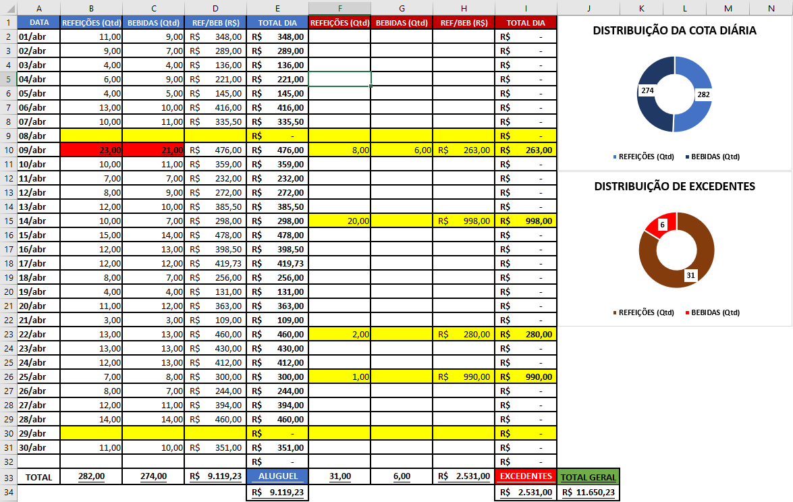

# Management Dashboard for Club Consumption (Excel)

## 🇧🇷 Português
**Descrição:** Sistema de gestão de consumo desenvolvido para conciliação financeira entre um clube e fornecedores. O projeto foca em automatizar a regra de negócio de "Cotas de Aluguel" vs "Excedentes".
*   **Destaques Técnicos:** Validação de dados, Formatação Condicional lógica e Dashboards de KPIs.

## 🇺🇸 English
**Description:** Consumption management system developed for financial reconciliation between a private club and its suppliers. The project focuses on automating the business logic of "Rental Quotas" vs "Overages".
*   **Technical Highlights:** Data validation, Logical Conditional Formatting, and KPI Dashboards.

## 🇳🇱 Nederlands (Dutch)
**Beschrijving:** Verbruiksbeheersysteem ontwikkeld voor financiële reconciliatie tussen een club en leveranciers. Het project richt zich op het automatiseren van de bedrijfslogica van "Huurquota" versus "Meerverbruik".
*   **Technische Hoogtepunten:** Gegevensvalidatie, Logische Voorwaardelijke Opmaak en KPI-dashboards.

## 🇧🇷 Regras de Negócio e Lógica do Sistema
*  O sistema foi projetado para gerenciar um contrato de locação complexo entre um restaurante concessionário de um clube privado, onde o controle de custos é dividido em duas camadas. A primeira camada é uma cota diárias de disponibilidade que prevê 15 unidades de Refeições e 15 unidades para Bebidas fornecidas do restaurante aos funcionários do clube.
*  A segunda camada é uma gestão de excedentes da cota diária e gastos com eventos particulares do clube. Qualquer unidade consumida além da 15ª (em qualquer categoria) é contabilizada como custo variável imediado. E os consumos realizados em dias de eventos são classificados integralmente como "Extra", independentemente do limite da cota.
*  Foi implementado uma Validação de Entrada dentro do sistema, utilizando lógica booleana para alertar visualmente (via Color Coding) quando um lançamento viola a regra da cota.

*  🇺🇸 English: Business Rules & System Logic
*  The system was engineered to manage a complex lease agreement between a private club and its concessionaire restaurant. Cost control is partitioned into two distinct layers. The primary layer is a Daily Availability Quota, which covers 15 Meal units and 15 Drink units provided by the restaurant to the club's staff.
*  The secondary layer handles consumption exceeding the daily quota and private club events. Any unit consumed beyond the 15th (per category) is recorded as an immediate variable cost. Furthermore, consumption on event days is classified entirely as "Extra," regardless of whether the quota limit was reached, ensuring full cost traceability.
*  Input Validation was implemented within the system, utilizing boolean logic to provide visual alerts (via Color Coding) when a record violates quota rules. This ensures data accuracy during financial reconciliation

*  🇳🇱 Nederlands (Dutch): Bedrijfsregels & Systeemlogica
*  Het systeem is ontworpen om een complex huurcontract te beheren tussen een privéclub en het bijbehorende concessierestaurant. De kostenbeheersing is opgedeeld in twee lagen. De eerste laag is een Dagelijks Beschikbaarheidsquotum, dat voorziet in 15 Maaltijdeenheden en 15 Drankeenheden die door het restaurant aan het clubpersoneel worden geleverd.
*  De tweede laag beheert het verbruik boven het dagelijkse quotum en de uitgaven voor privé-evenementen van de club. Elke eenheid die boven de 15e wordt verbruikt (per categorie), wordt geregistreerd als onmiddellijke variabele kosten. Bovendien wordt het verbruik op evenementdagen volledig als "Extra" geclassificeerd, ongeacht of de quotumlimiet is bereikt, wat een volledige traceerbaarheid van de kosten garandeert.
*  Het systeem bevat invoervalidatie, waarbij booleaanse logica wordt gebruikt om visuele waarschuwingen te geven (via Kleurcodering) wanneer een invoer de quotumregels overtreedt. Dit waarborgt de nauwkeurigheid van de gegevens tijdens de financiële afstemming.

*  ## Dashboard Preview

  
